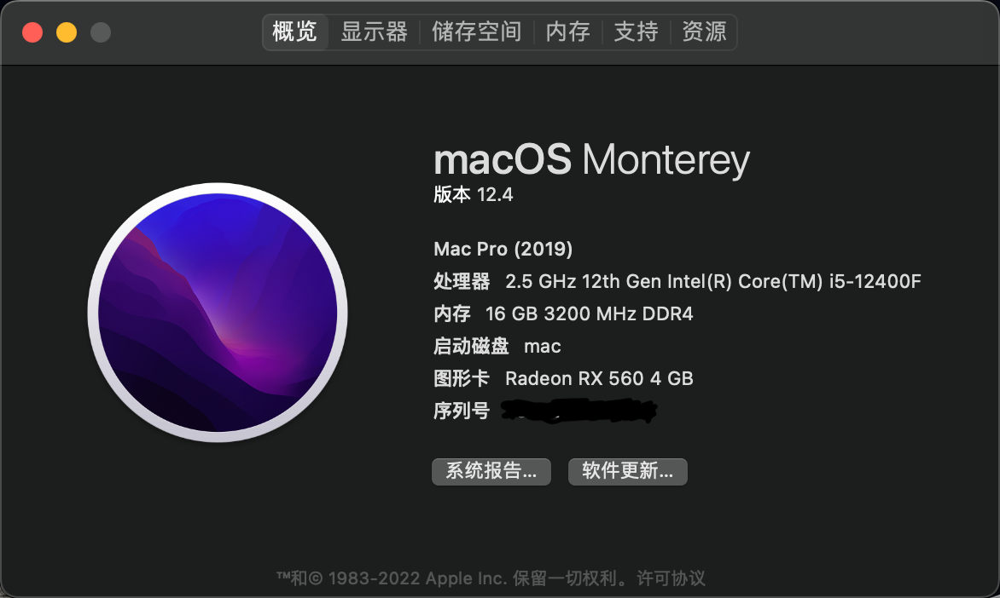
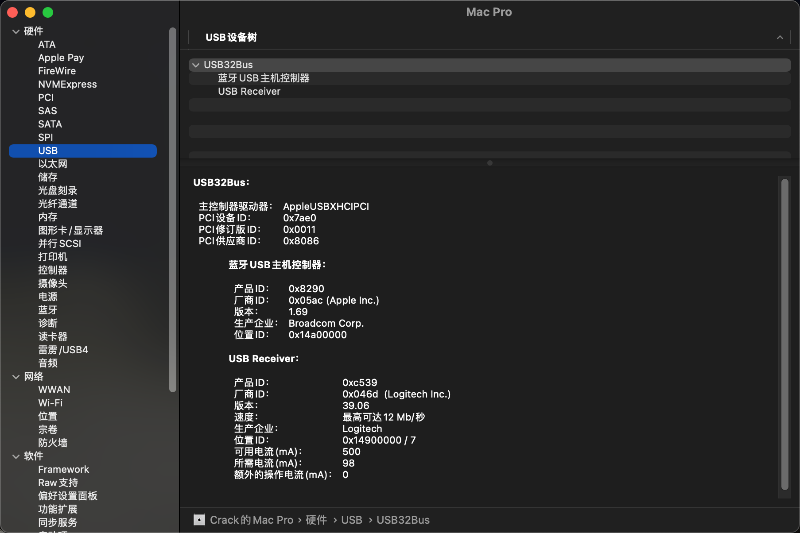
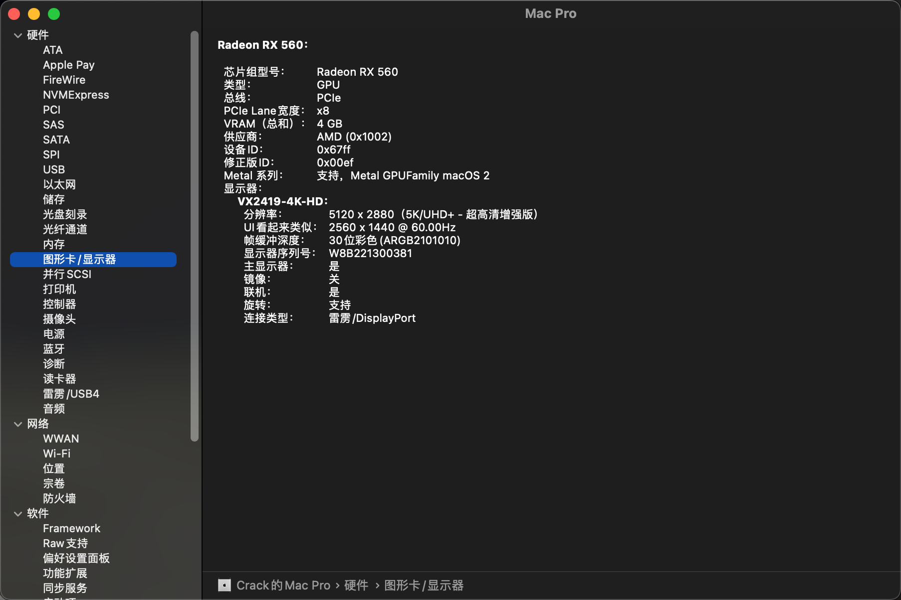
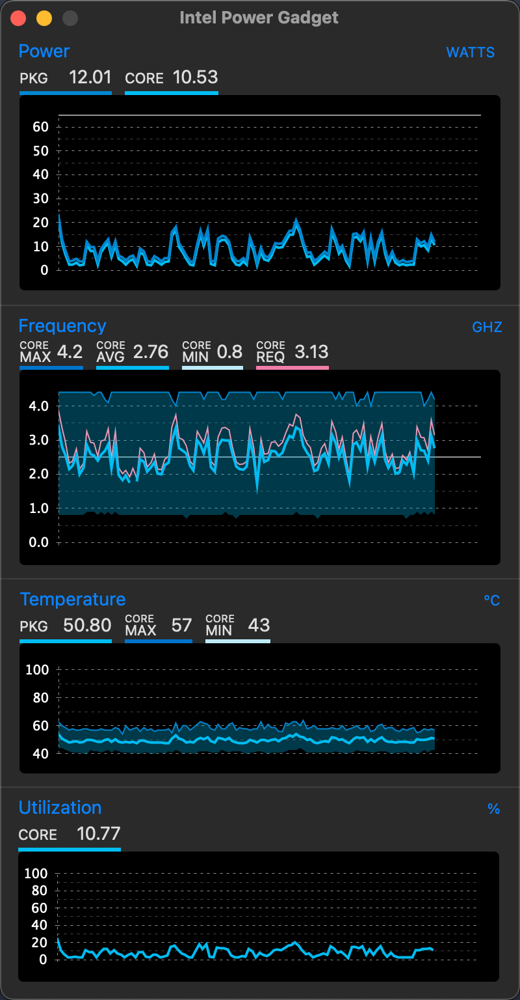

# Hackintosh-MAXSUN铭瑄挑战者-H610ITX-I512400-rx560

适用于 12400 + 铭瑄H610ITX DDR4 +RX560黑苹果引导文件

基于 OpenCore 0.7.7 版本，机型 MacPro 7,1，系统 MacOS 12.4

# 本机配置

| 配置        | 型号                   |
|-----------|----------------------|
| CPU       | intel i5 12400       |
| 主板        | 铭瑄挑战者 H610ITX        |
| 显卡        | 精影RX560              |
| 内存        | 光威天策  3200MHz 8G * 2 |
| SSD       | 凯侠RC20 500G          |
| WiFi + 蓝牙 | BCM943602cs          |

# 正常驱动
* 声卡完美驱动
* USB接口正常
* 音量调节正常
* 有线无线网卡正常
* 睡眠唤醒正常
* CPU睿频正常
* 隔空投送正常
* 接力正常

# 无法驱动
* 随航无法使用（可连接，黑屏，因无法驱动核显）通用控制正常

# 个人精力有限，欢迎大佬和我一起来维护这个仓库

